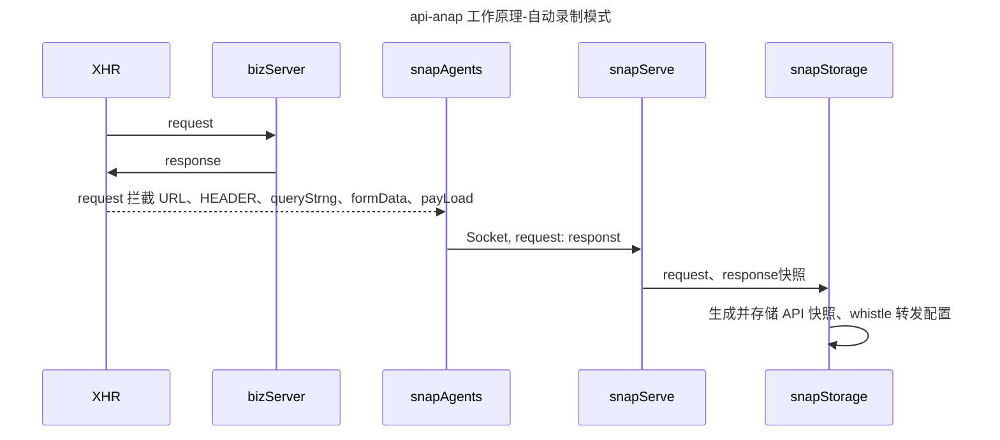
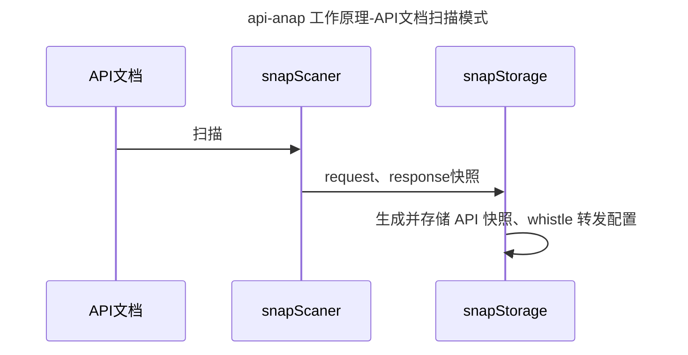
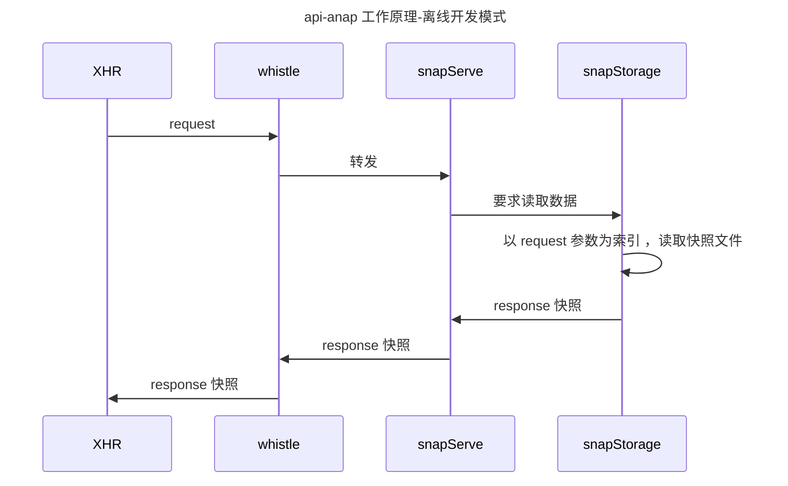

# 解决问题

在没有服务端同学支持的情况下，前端开发者仍可以进行离线开发。

工作原理是：

- 正常开发时，通过原型注入的方式，自动录制请求快照。
- 仅有 swagger 文档时，手动扫描文档并生成快照（需要精确提供定型的 swagger 文档）。
- 离线开发时，由 whistle 把前端请求转发到快照服务，利用快照服务模拟 API 请求/返回。


# 自动录制模式


# API文档扫描模式




# 快照文件数据结构


- 文件名：[URL]-[QUERYSTRING].json / js

- 数据结构：

  ```typescript
  QueryStrngMap: Map<queryString:string, response: string>;
  FormDataMap: Map<formData:string, response: string>;
  PayLoadMap: Map<payLoad:Object, response: string>;
  
  SnapStorage: Map<method: 'GET'|'POST'|'PUT'|'DELETE'|'OPTION', RequestResponstMap: QueryStrngMap| FormDataMap | PayLoadMap>
  ```

  

```typescript

```


# 离线开发模式


